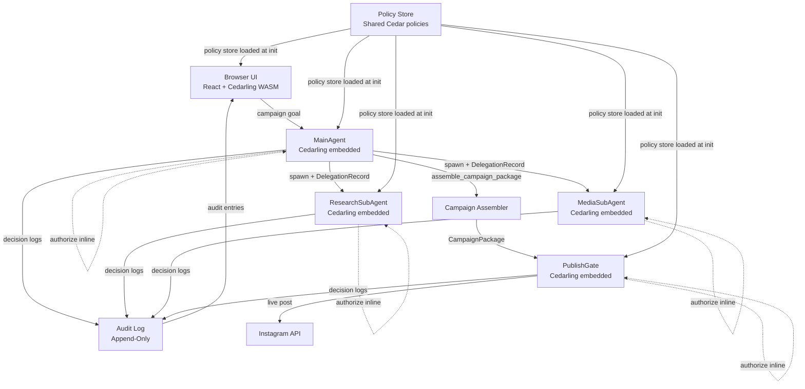

# Design Document: Clawdia Schiffer Agent

## Overview

Clawdia Schiffer is a policy-governed activist AI agent that campaigns against bottom trawling. The system's defining characteristic is that Cedar authorization is embedded *inside* the agent loop — not bolted on afterward. Every action, every subagent delegation, and every publish decision is authorized by an embedded Cedarling instance running in-process within each component — not by an external proxy or interceptor.

The architecture demonstrates four key patterns:

1. **Policy Inside the Loop** — the agent cannot act without authorization; denials are replanning signals, not crashes
2. **Constraints Before Action** — at initialization, `cedarling.get_policies(principal, actions)` retrieves applicable policies; `@description` annotations provide human-readable constraints that are injected into the agent's system prompt, so the agent plans within policy from the start — without spending tokens on a separate constraint-query round-trip. Policies without `@description` are described by an LLM fallback. Every tool call is still authorized inline by the embedded Cedarling (see pattern 1), so enforcement remains deterministic regardless of what the LLM plans
3. **Delegation as Data** — subagent authority is an explicit `DelegationRecord` stored and enforced by the same PDP, not a copied capability
4. **Frontal Lobes for AI** — the Publish Gate uses deterministic Cedar policy to decide live vs. draft, removing LLM judgment from the critical path

The system supports three demo scenarios: a full governed happy path (saves as draft), an overreach-blocked scenario (live publish denied → replanned as draft), and a subagent confinement proof (ResearchSubAgent publish attempt denied).

---

## Architecture



### Request Flow

Each component authorizes inline before acting:

```
component.executeAction(principal, action, resource, context):
  decision = cedarling.authorize(principal, action, resource, context)
  if decision.deny:
    log decision to AuditLog
    return DenialResponse(diagnostics: decision.diagnostics)
  log decision to AuditLog
  return toolImplementation(args)
```

At initialization, the application calls `cedarling.get_policies(principal, actions)` to retrieve
all policies with their annotations and source code. Policies with `@description`
annotations provide human-readable constraint descriptions directly; policies
without `@description` are passed to an LLM to generate descriptions. The
collected constraints are injected into the MainAgent's system prompt, so the
agent plans within policy from the start — without spending tokens on a separate
MCP constraint-query call. This is a planning optimization only; it does not
weaken enforcement. Every tool call is still authorized inline by the
component's embedded Cedarling before execution.

Each Cedarling instance is initialized at component startup with the shared
policy store. Decision logs are retrieved from the Cedarling's internal log
interface and forwarded to the central AuditLog after each decision.

---

## Components and Interfaces

### MainAgent

The primary orchestrating agent. Implements the loop: plan → delegate → assemble → publish. Policy constraints are injected into the system prompt at initialization (see `buildSystemPrompt`), so the agent plans within policy from the start. Every tool call is still authorized inline by the embedded Cedarling.

```typescript
interface MainAgent {
  run(goal: CampaignGoal): Promise<CampaignResult>;
  // buildSystemPrompt takes constraint descriptions derived from policy
  // @description annotations (via ConstraintBuilder.buildConstraintPrompt)
  // and embeds them into the agent's system prompt. This replaces a runtime
  // query_authorization_constraints MCP call — zero extra tokens.
  buildSystemPrompt(constraintPrompt: string): string;
  delegate(subagent: SubAgentType, scope: DelegationScope): Promise<DelegationRecord>;
  replan(denial: DenialResponse, currentPlan: Plan): Promise<Plan>;
}
```

### Cedarling (Embedded PDP)

Each component embeds its own Cedarling instance, initialized at startup with the shared policy store. Authorization is evaluated in-process — no network hop, no external service dependency.

```typescript
interface EmbeddedCedarling {
  // Evaluate a Cedar policy decision inline.
  // Called directly by the component before executing any action.
  authorize(req: AuthorizationRequest): Promise<AuthorizationDecision>;

  // Return policies from the loaded .cjar policy store that apply to the
  // given principal (or tokens) and action(s). Each entry contains the
  // policy ID, a map of annotations (including @description if present),
  // and the policy source code in Cedar or JSON.
  // Called at MainAgent init to build the system prompt from @description.
  get_policies(
    principal: Principal | TokenSet,
    actions: Action[]
  ): PolicyInfo[];

  // Retrieve decision logs from the Cedarling's internal log cache.
  // Called after each decision to forward entries to the central AuditLog.
  getLogs(): AuditEntry[];
}

interface PolicyInfo {
  id: string;                          // value of @id annotation
  annotations: Record<string, string>; // all annotations, e.g. { ai_advice: "...", id: "..." }
  source: string;                      // Cedar source code of the policy
  format: 'cedar' | 'json';           // cedar preferred
}
```

### Building the System Prompt from Policy Annotations

The Policy Store is a `.cjar` file containing Cedar policies, schema, and
trusted IDP configuration. It is loaded once at startup by every Cedarling
instance.

At MainAgent initialization, the application calls `cedarling.get_policies(principal, actions)`
to retrieve all policies with their annotations and source code. For each
policy:

1. If the policy has an `@description` annotation — use its value directly as a
   human-readable constraint for the system prompt.
2. If the policy has no `@description` — pass the Cedar source code to an LLM to
   generate a natural-language description of the constraint.

The collected constraint descriptions are assembled into the MainAgent's system
prompt, so the agent plans within policy from the start. No separate MCP
constraint-query call is needed — zero extra tokens at runtime.

```typescript
interface ConstraintBuilder {
  // Takes the PolicyInfo[] returned by cedarling.get_policies(principal, actions),
  // extracts @description annotations, and falls back to LLM description for
  // policies without @description. Returns assembled constraint text for the
  // system prompt.
  buildConstraintPrompt(policies: PolicyInfo[]): Promise<string>;
}
```

### ResearchSubAgent

Bounded to: `search_sources`, `fetch_article`, `extract_claims`. Calls `cedarling.authorize(...)` inline before each tool execution.

```typescript
interface ResearchSubAgent {
  research(topic: string, delegation: DelegationRecord): Promise<ResearchResult>;
}
```

### MediaSubAgent

Bounded to: `generate_campaign_image`, `draft_instagram_caption`. Calls `cedarling.authorize(...)` inline before each tool execution.

```typescript
interface MediaSubAgent {
  produce(brief: MediaBrief, delegation: DelegationRecord): Promise<MediaResult>;
}
```

### Campaign Assembler

Combines research and media into a `CampaignPackage` with a computed `ConfidenceScore`.

```typescript
interface CampaignAssembler {
  assemble(
    claims: ClaimWithCitation[],
    media: MediaResult,
    delegationIds: string[]
  ): CampaignPackage;
}
```

### Publish Gate

Evaluates a `CampaignPackage` against Cedar publish policy. Deterministic — no LLM involvement.

```typescript
interface PublishGate {
  // Validates approver IDP tokens, then evaluates CampaignPackage against Cedar policy.
  evaluateLive(
    pkg: CampaignPackage,
    approverTokens?: { idToken: string; userInfoToken: string }
  ): Promise<PublishDecision>;
  saveDraft(pkg: CampaignPackage): Promise<PublishDecision>;
}
```

### Audit Log

Append-only. Accepts decision log entries forwarded from each component's embedded Cedarling instance after every authorization decision. Streams to Browser UI.

```typescript
interface AuditLog {
  append(entry: AuditEntry): void;
  getAll(): AuditEntry[];
}
```

### Browser UI (React + Cedarling WASM)

Renders real-time policy decisions, agent phase, and final campaign summary. Loads Cedarling WASM on startup for in-browser policy evaluation visibility.

---

## Data Models

### Principal

```typescript
type PrincipalType = 'MainAgent' | 'ResearchSubAgent' | 'MediaSubAgent' | 'Human';

interface Principal {
  id: string;
  type: PrincipalType;
  delegationRecordId?: string; // set for subagents
}
```

### ApproverIdentity

```typescript
// Parsed and validated representation of the approver's IDP tokens.
// Constructed by the PublishGate after validating id_token and userinfo_token
// against account.gluu.org.
interface ApproverIdentity {
  sub: string;              // subject identifier from id_token
  iss: string;              // issuer — validated to equal "https://account.gluu.org"
  role: string;             // from userinfo_token claims — must equal "clawdia-admin"
  idTokenExp: number;       // Unix timestamp from id_token exp claim
  userInfoTokenExp: number; // Unix timestamp from userinfo_token exp claim
  validatedAt: string;      // ISO 8601 — when the PublishGate validated the tokens
}
```

### Action

```typescript
type Action =
  | 'DelegateAuthorization'
  | 'Search'
  | 'Fetch'
  | 'Extract'
  | 'GenerateImage'
  | 'DraftCaption'
  | 'Assemble'
  | 'PublishDraft'
  | 'PublishLive';
```

### DelegationRecord

```typescript
interface DelegationRecord {
  id: string;                    // UUID
  parentPrincipalId: string;
  subagentPrincipalId: string;
  permittedActions: Action[];
  allowedResources: ResourcePattern[];
  issuedAt: string;              // ISO 8601
  expiresAt: string;             // ISO 8601 — TTL enforced by PDP
}
```

### PolicyContext

```typescript
interface PolicyContext {
  delegationRecordId?: string;
  allowedDomains?: ApprovedDomain[];
  claimConfidence?: number;
  citationCount?: number;
  requestedDomain?: string;
  // IDP approval fields (replaces opaque approvalToken)
  requiresApprovalToken?: boolean;
  approverSub?: string;           // sub from id_token
  approverIss?: string;           // iss — must be "https://account.gluu.org"
  approverRole?: string;          // role from userinfo_token — must be "clawdia-admin"
  idTokenExp?: number;            // Unix timestamp
  userInfoTokenExp?: number;      // Unix timestamp
}
```

### ApprovedDomain

```typescript
type DomainTier = 'government_scientific' | 'ngo_advocacy' | 'academic';

interface ApprovedDomain {
  domain: string;
  tier: DomainTier;
  label: string;
}

const APPROVED_DOMAINS: ApprovedDomain[] = [
  // Tier 1 — Government/Scientific
  { domain: 'fisheries.noaa.gov', tier: 'government_scientific', label: 'NOAA Fisheries' },
  { domain: 'fao.org',            tier: 'government_scientific', label: 'FAO' },
  { domain: 'ices.dk',            tier: 'government_scientific', label: 'ICES' },
  { domain: 'ipbes.net',          tier: 'government_scientific', label: 'IPBES' },
  // Tier 2 — NGO/Advocacy
  { domain: 'oceana.org',         tier: 'ngo_advocacy',          label: 'Oceana' },
  { domain: 'wwf.org',            tier: 'ngo_advocacy',          label: 'WWF' },
  { domain: 'mcsuk.org',          tier: 'ngo_advocacy',          label: 'MCS UK' },
  { domain: 'edf.org',            tier: 'ngo_advocacy',          label: 'EDF' },
  // Tier 3 — Academic
  { domain: 'scholar.google.com', tier: 'academic',              label: 'Google Scholar' },
  { domain: 'sciencedirect.com',  tier: 'academic',              label: 'ScienceDirect' },
];
```

### ClaimCitation

```typescript
interface ClaimCitation {
  sourceUrl: string;
  sourceDomain: string;
  domainTier: DomainTier;
  retrievedAt: string; // ISO 8601
}
```

### CampaignPackage

```typescript
interface CampaignPackage {
  id: string;                          // UUID
  claims: ClaimWithCitation[];
  mediaRefs: MediaReference[];
  confidenceScore: number;             // 0.0–1.0
  hasUnverifiedClaims: boolean;
  delegationRecordIds: string[];       // provenance of each component
  assembledAt: string;                 // ISO 8601
}

interface ClaimWithCitation {
  text: string;
  citation: ClaimCitation | null;      // null → flagged as unverified
  verified: boolean;
}
```

### AuthorizationRequest / Decision

```typescript
interface AuthorizationRequest {
  principal: Principal;
  action: Action;
  resource: Resource;
  context: PolicyContext;
}

interface AuthorizationDecision {
  decision: 'Allow' | 'Deny';
  reason?: string;
  diagnostics?: string[];
}
```

### DenialResponse

```typescript
interface DenialResponse {
  denied: true;
  principal: Principal;
  action: Action;
  resource: Resource;
  reason: string;
  approvedAlternatives?: Action[];     // e.g. ['PublishDraft'] when 'PublishLive' denied
  approvedDomains?: ApprovedDomain[];  // returned when domain not approved
}
```

### AuditEntry

```typescript
type AuditEntryType = 'authorization' | 'publish';

interface AuthorizationAuditEntry {
  type: 'authorization';
  id: string;
  principalId: string;
  principalType: PrincipalType;
  action: Action;
  resource: string;
  decision: 'Allow' | 'Deny';
  denialReason?: string;
  timestamp: string; // ISO 8601
}

interface PublishAuditEntry {
  type: 'publish';
  id: string;
  campaignPackageId: string;
  publishType: 'draft' | 'live';
  confidenceScore: number;
  claimCount: number;
  citationCount: number;
  policyEvaluationResult: 'Allow' | 'Deny';
  approverSub?: string;              // sub from id_token, present for live publish attempts
  tokenValidationResult?: 'valid' | 'invalid_issuer' | 'invalid_role' | 'expired' | 'missing';
  timestamp: string; // ISO 8601
}

type AuditEntry = AuthorizationAuditEntry | PublishAuditEntry;
```

### PublishDecision

```typescript
interface PublishDecision {
  allowed: boolean;
  publishType: 'draft' | 'live';
  campaignPackageId: string;
  denialReason?: string;
}
```

### ConstraintSet

```typescript
interface ConstraintSet {
  allowedActions: Action[];
  allowedDomains: ApprovedDomain[];
  publishRequirements: {
    minConfidenceScore: number;       // 0.8 for live
    requiresApprovalToken: boolean;
    requiresAllClaimsCited: boolean;
  };
}
```

### AgentPhase

```typescript
type AgentPhase =
  | 'Idle'
  | 'Planning'
  | 'Researching'
  | 'Generating'
  | 'Assembling'
  | 'Publishing'
  | 'Done'
  | 'Error';
```

---

## Cedar Policy Model

### Authorization Model: PARC for Agents, ARC for Humans

This system uses two authorization styles, as described in [From PARC to ARC: Policies Without People](https://gluufederation.medium.com/from-parc-to-arc-policies-without-people-3f393ac1d3cd):

- **PARC (Principal, Action, Resource, Context)** — used for agent policies (1–5, 10–12). These policies constrain on `principal.agentType` because the agent's identity (MainAgent, ResearchSubAgent, MediaSubAgent) is the relevant authority boundary.
- **ARC (Action, Resource, Context)** — used for human approver policies (9a, 9b, 9c). These policies do not constrain on the principal at all. Instead, they evaluate only the token claims present in `context`. The question is not "who are you?" but "do your tokens carry the required claims to authorize this action, here, now?" This is appropriate for the approver because the approver's identity is asserted by the IDP tokens themselves — the principal slot is irrelevant.

### Schema

```cedarschema
namespace Clawdia {

  // ── Entity Types ──────────────────────────────────────────────────────────

  // Represents any autonomous agent principal in the system.
  // agentType distinguishes MainAgent from the two subagent roles.
  entity Agent = {
    agentType: String,  // "MainAgent" | "ResearchSubAgent" | "MediaSubAgent"
  };

  // Represents an authenticated human approver.
  // Populated from validated id_token and userinfo_token claims.
  entity Human = {
    sub: String,          // subject identifier from id_token
    iss: String,          // issuer — must equal "https://account.gluu.org"
    role: String,         // from userinfo_token — must equal "clawdia-admin"
    idTokenExp: Long,     // expiry of id_token (Unix timestamp)
    userInfoTokenExp: Long, // expiry of userinfo_token (Unix timestamp)
  };

  // Represents a tool invocation target (search endpoint, Instagram API, etc.).
  entity ToolResource = {
    toolName: String,
  };

  // Represents a web domain being accessed during research.
  entity Domain = {
    name: String,
    tier: String,  // "government_scientific" | "ngo_advocacy" | "academic"
  };

  // Represents the assembled campaign artifact being evaluated for publish.
  entity CampaignPackage = {
    confidenceScore: Decimal,
    hasUnverifiedClaims: Bool,
  };

  // ── Actions ───────────────────────────────────────────────────────────────

  // MainAgent-only orchestration actions
  action DelegateAuthorization appliesTo {
    principal: Agent,
    resource: ToolResource,
    context: {
      currentTime: Long,
    }
  };

  action Assemble appliesTo {
    principal: Agent,
    resource: ToolResource,
    context: {
      currentTime: Long,
    }
  };

  action PublishDraft appliesTo {
    principal: Agent,
    resource: CampaignPackage,
    context: {
      currentTime: Long,
    }
  };

  // ARC-style action: principal type is unconstrained so policy logic
  // can evaluate purely on context token claims, not principal identity.
  action PublishLive appliesTo {
    principal: [Agent, Human],
    resource: CampaignPackage,
    context: {
      confidenceScore: Decimal,
      hasUnverifiedClaims: Bool,
      requiresApprovalToken: Bool,
      // IDP token fields — replaces opaque approvalToken
      approverSub: String,          // sub from id_token
      approverIss: String,          // iss from id_token — must be "https://account.gluu.org"
      approverRole: String,         // role from userinfo_token — must be "clawdia-admin"
      idTokenExp: Long,             // exp from id_token
      userInfoTokenExp: Long,       // exp from userinfo_token
      currentTime: Long,
    }
  };

  // ResearchSubAgent actions — require delegation context
  action Search appliesTo {
    principal: Agent,
    resource: Domain,
    context: {
      delegationRecordId: String,
      delegationPermittedActions: Set<String>,
      delegationExpiresAt: Long,
      currentTime: Long,
      requestedDomain: String,
    }
  };

  action Fetch appliesTo {
    principal: Agent,
    resource: Domain,
    context: {
      delegationRecordId: String,
      delegationPermittedActions: Set<String>,
      delegationExpiresAt: Long,
      currentTime: Long,
      requestedDomain: String,
    }
  };

  action Extract appliesTo {
    principal: Agent,
    resource: ToolResource,
    context: {
      delegationRecordId: String,
      delegationPermittedActions: Set<String>,
      delegationExpiresAt: Long,
      currentTime: Long,
    }
  };

  // MediaSubAgent actions — require delegation context
  action GenerateImage appliesTo {
    principal: Agent,
    resource: ToolResource,
    context: {
      delegationRecordId: String,
      delegationPermittedActions: Set<String>,
      delegationExpiresAt: Long,
      currentTime: Long,
    }
  };

  action DraftCaption appliesTo {
    principal: Agent,
    resource: ToolResource,
    context: {
      delegationRecordId: String,
      delegationPermittedActions: Set<String>,
      delegationExpiresAt: Long,
      currentTime: Long,
    }
  };

}
```

### Policies

```cedar
@id("policy-001")
@description("You (MainAgent) may delegate authorization, assemble campaigns, and publish (draft or live).")
permit (
  principal is Clawdia::Agent,
  action in [
    Clawdia::Action::"DelegateAuthorization",
    Clawdia::Action::"Assemble",
    Clawdia::Action::"PublishDraft",
    Clawdia::Action::"PublishLive"
  ],
  resource
)
when {
  principal.agentType == "MainAgent"
};


@id("policy-002")
@description("ResearchSubAgent may only Search, Fetch, and Extract — and only when it has a valid delegation.")
permit (
  principal is Clawdia::Agent,
  action in [
    Clawdia::Action::"Search",
    Clawdia::Action::"Fetch",
    Clawdia::Action::"Extract"
  ],
  resource
)
when {
  principal.agentType == "ResearchSubAgent" &&
  context.delegationRecordId != "" &&
  context.delegationPermittedActions.contains(action.toString())
};


@id("policy-003")
@description("MediaSubAgent may only GenerateImage and DraftCaption — and only when it has a valid delegation.")
permit (
  principal is Clawdia::Agent,
  action in [
    Clawdia::Action::"GenerateImage",
    Clawdia::Action::"DraftCaption"
  ],
  resource
)
when {
  principal.agentType == "MediaSubAgent" &&
  context.delegationRecordId != "" &&
  context.delegationPermittedActions.contains(action.toString())
};


@id("policy-004")
@description("Subagent delegations expire. Once the TTL is past, all subagent tool calls are denied.")
forbid (
  principal is Clawdia::Agent,
  action in [
    Clawdia::Action::"Search",
    Clawdia::Action::"Fetch",
    Clawdia::Action::"Extract",
    Clawdia::Action::"GenerateImage",
    Clawdia::Action::"DraftCaption"
  ],
  resource
)
when {
  principal.agentType != "MainAgent" &&
  context.currentTime >= context.delegationExpiresAt
};


@id("policy-005")
@description("Subagents can only perform actions listed in their DelegationRecord. Anything else is denied.")
forbid (
  principal is Clawdia::Agent,
  action in [
    Clawdia::Action::"Search",
    Clawdia::Action::"Fetch",
    Clawdia::Action::"Extract",
    Clawdia::Action::"GenerateImage",
    Clawdia::Action::"DraftCaption"
  ],
  resource
)
when {
  principal.agentType != "MainAgent" &&
  !context.delegationPermittedActions.contains(action.toString())
};


@id("policy-006")
@description("Research is restricted to approved domains only: fisheries.noaa.gov, fao.org, ices.dk, ipbes.net, oceana.org, wwf.org, mcsuk.org, edf.org, scholar.google.com, sciencedirect.com. All other domains are denied.")
forbid (
  principal is Clawdia::Agent,
  action in [
    Clawdia::Action::"Search",
    Clawdia::Action::"Fetch"
  ],
  resource
)
when {
  !(
    context.requestedDomain == "fisheries.noaa.gov" ||
    context.requestedDomain == "fao.org"            ||
    context.requestedDomain == "ices.dk"            ||
    context.requestedDomain == "ipbes.net"          ||
    context.requestedDomain == "oceana.org"         ||
    context.requestedDomain == "wwf.org"            ||
    context.requestedDomain == "mcsuk.org"          ||
    context.requestedDomain == "edf.org"            ||
    context.requestedDomain == "scholar.google.com" ||
    context.requestedDomain == "sciencedirect.com"
  )
};


@id("policy-007")
@description("Live publishing requires a confidence score of at least 0.8. Below that threshold, publish as draft instead.")
forbid (
  principal is Clawdia::Agent,
  action == Clawdia::Action::"PublishLive",
  resource
)
when {
  context.confidenceScore < decimal("0.8")
};


@id("policy-008")
@description("Live publishing is denied if any claim lacks a citation. All claims must be verified before going live.")
forbid (
  principal is Clawdia::Agent,
  action == Clawdia::Action::"PublishLive",
  resource
)
when {
  context.hasUnverifiedClaims == true
};


@id("policy-009a")
@description("Live publishing requires a human approver whose tokens were issued by account.gluu.org.")
forbid (
  principal,
  action == Clawdia::Action::"PublishLive",
  resource
)
when {
  context.requiresApprovalToken == true &&
  context.approverIss != "https://account.gluu.org"
};


@id("policy-009b")
@description("Live publishing requires the human approver to have the clawdia-admin role.")
forbid (
  principal,
  action == Clawdia::Action::"PublishLive",
  resource
)
when {
  context.requiresApprovalToken == true &&
  context.approverRole != "clawdia-admin"
};


@id("policy-009c")
@description("Live publishing is denied if the approver's id_token or userinfo_token has expired.")
forbid (
  principal,
  action == Clawdia::Action::"PublishLive",
  resource
)
when {
  context.requiresApprovalToken == true &&
  (
    context.currentTime >= context.idTokenExp ||
    context.currentTime >= context.userInfoTokenExp
  )
};


@id("policy-010")
@description("Draft publishing is always allowed for MainAgent — no confidence threshold or approval needed.")
permit (
  principal is Clawdia::Agent,
  action == Clawdia::Action::"PublishDraft",
  resource
)
when {
  principal.agentType == "MainAgent"
};


@id("policy-011")
@description("ResearchSubAgent is forbidden from publishing (draft or live). This is a hard confinement rule.")
forbid (
  principal is Clawdia::Agent,
  action in [
    Clawdia::Action::"PublishDraft",
    Clawdia::Action::"PublishLive"
  ],
  resource
)
when {
  principal.agentType == "ResearchSubAgent"
};


@id("policy-012")
@description("MediaSubAgent is forbidden from research actions (Search, Fetch). This is a hard confinement rule.")
forbid (
  principal is Clawdia::Agent,
  action in [
    Clawdia::Action::"Search",
    Clawdia::Action::"Fetch"
  ],
  resource
)
when {
  principal.agentType == "MediaSubAgent"
};
```

---

## Correctness Properties

*A property is a characteristic or behavior that should hold true across all valid executions of a system — essentially, a formal statement about what the system should do. Properties serve as the bridge between human-readable specifications and machine-verifiable correctness guarantees.*

### Property 1: Constraints Embedded in System Prompt Before Planning

*For any* MainAgent initialization, `cedarling.get_policies(principal, actions)` must be called and all `@description` annotations (plus LLM-generated descriptions for policies without `@description`) must be assembled into the system prompt before any campaign goal is processed. If `get_policies()` returns an empty list, the MainAgent must not start.

**Validates: Requirements 1.1, 1.2**

---

### Property 2: Plan Actions Are a Subset of Allowed Actions

*For any* ConstraintSet returned by `query_authorization_constraints`, every action proposed in the resulting execution plan must be present in `constraintSet.allowedActions`. No plan may contain an action not permitted by the retrieved constraints.

**Validates: Requirements 1.2, 1.4**

---

### Property 3: Cedarling Consulted Before Every Action

*For any* action attempted by any component (MainAgent, ResearchSubAgent, or MediaSubAgent), the component's embedded Cedarling instance must be called and return an `AuthorizationDecision` before the action executes. No action may proceed without a prior in-process Cedarling evaluation.

**Validates: Requirements 2.1**

---

### Property 4: Components Route Correctly on Allow and Deny

*For any* action where Cedarling returns `Allow`, the action implementation must be called and its result returned. *For any* action where Cedarling returns `Deny`, the action implementation must not be called and a `DenialResponse` must be constructed from Cedarling diagnostics.

**Validates: Requirements 2.2, 2.3**

---

### Property 5: Denial Triggers Replanning

*For any* `DenialResponse` returned to the MainAgent, the agent must invoke `replan` with the denial as input rather than retrying the same action or halting without a structured response.

**Validates: Requirements 2.4, 6.5, 8.2**

---

### Property 6: Every Action Produces an Audit Entry

*For any* action evaluated by any embedded Cedarling instance (regardless of Allow or Deny), exactly one `AuthorizationAuditEntry` must be forwarded to the central audit log containing the principal, action, resource, decision, and timestamp.

**Validates: Requirements 2.5, 10.1**

---

### Property 7: Subagent Delegation Scope Is Correct

*For any* subagent spawned by the MainAgent, the resulting `DelegationRecord.permittedActions` must equal exactly the expected action set for that subagent type: `{Search, Fetch, Extract}` for ResearchSubAgent and `{GenerateImage, DraftCaption}` for MediaSubAgent. No additional actions may be granted.

**Validates: Requirements 3.1, 3.4, 3.5**

---

### Property 8: DelegationRecord Constrains Subagent Tool Calls

*For any* subagent tool call, if the requested action is not in the subagent's `DelegationRecord.permittedActions`, the PDP must return `Deny` regardless of what base policy would permit.

**Validates: Requirements 3.2**

---

### Property 9: Expired DelegationRecord Denies All Calls

*For any* subagent whose `DelegationRecord.expiresAt` is in the past, every tool call from that subagent must be denied by the PDP.

**Validates: Requirements 3.3**

---

### Property 10: Subagent Confinement — Out-of-Scope Actions Denied

*For any* action attempted by a ResearchSubAgent that is a publish action (`PublishDraft` or `PublishLive`), the PDP must return `Deny`. *For any* action attempted by a MediaSubAgent that is a search or fetch action (`Search` or `Fetch`), the PDP must return `Deny`. The `DenialResponse` must be structured as a confinement violation.

**Validates: Requirements 3.6, 3.7, 9.1, 9.2**

---

### Property 11: Domain Enforcement on Research Tool Calls

*For any* `search_sources` or `fetch_article` call, if the target domain is in `APPROVED_DOMAINS` the PDP must return `Allow`; if the domain is not in `APPROVED_DOMAINS` the PDP must return `Deny` and the `DenialResponse` must include the full `approvedDomains` list.

**Validates: Requirements 4.1, 4.2, 4.3**

---

### Property 12: Every Extracted Claim Has a Citation

*For any* call to `extract_claims` that returns successfully, every `ClaimWithCitation` in the result must have a non-null `citation` field referencing the source URL and domain.

**Validates: Requirements 4.4**

---

### Property 13: Campaign Assembly Completeness

*For any* set of claims and media passed to `assemble_campaign_package`, the resulting `CampaignPackage` must contain all input claims, all media references, and all provided delegation record IDs in its metadata.

**Validates: Requirements 5.1, 5.4**

---

### Property 14: ConfidenceScore Computation Invariant

*For any* set of claims where `citedCount` claims have a non-null citation and `totalCount` is the total number of claims, the assembled `CampaignPackage.confidenceScore` must equal `citedCount / totalCount` (or `1.0` if `totalCount` is 0).

**Validates: Requirements 5.2**

---

### Property 15: Uncited Claims Are Flagged Unverified

*For any* `ClaimWithCitation` where `citation` is null, the `verified` field must be `false` and `CampaignPackage.hasUnverifiedClaims` must be `true`.

**Validates: Requirements 5.3**

---

### Property 16: Live Publish Threshold Enforcement

*For any* `CampaignPackage` where `confidenceScore < 0.8` or `hasUnverifiedClaims === true` or a required approval token is absent, `publish_instagram_live` must be denied by the PublishGate.

**Validates: Requirements 6.2, 6.3, 6.4**

---

### Property 17: Draft Publish Is Always Permitted

*For any* `CampaignPackage` regardless of `confidenceScore`, unverified claims, or absence of an approval token, `publish_instagram_draft` must be allowed by the PublishGate.

**Validates: Requirements 6.6**

---

### Property 18: Every Publish Event Produces an Audit Entry

*For any* publish invocation (draft or live, allowed or denied), exactly one `PublishAuditEntry` must be appended to the audit log containing the campaign package ID, publish type, confidence score, claim count, citation count, and policy evaluation result.

**Validates: Requirements 6.7, 10.2**

---

### Property 19: Audit Log Is Append-Only and Ordered

*For any* sequence of `append` calls, `getAll()` must return all entries in the order they were appended (chronological by timestamp), and no previously appended entry may be modified or absent.

**Validates: Requirements 10.3, 10.4**

---

### Property 20: UI Renders All Required Fields for Authorization Events

*For any* `AuditEntry` of type `authorization`, the rendered UI component must include the principal identifier, principal type, action, resource, decision (Allow/Deny), and timestamp. For denied entries, the denial reason must also be present. For confinement violations, the principal type and denied action must be labeled distinctly.

**Validates: Requirements 7.2, 7.4, 8.3, 9.3**

---

### Property 21: UI Renders Complete Campaign Summary

*For any* completed `CampaignPackage`, the rendered summary component must include the confidence score, claim count, citation count, and publish status.

**Validates: Requirements 7.5**

---

### Property 22: Approver IDP Issuer Enforcement (ARC)

*For any* `PublishLive` request where `requiresApprovalToken` is true, if `approverIss` is not exactly `"https://account.gluu.org"`, the PDP must return `Deny`. This property is enforced by an ARC-style policy — the principal identity is irrelevant; only the token claim in context is evaluated.

**Validates: Requirements 11.2**

---

### Property 23: Approver Role and Token Expiry Enforcement (ARC)

*For any* `PublishLive` request where `requiresApprovalToken` is true, if `approverRole` is not exactly `"clawdia-admin"`, or if `currentTime >= idTokenExp`, or if `currentTime >= userInfoTokenExp`, the PDP must return `Deny`.

**Validates: Requirements 11.3, 11.4**

---

### Property 24: Approver Identity Recorded in Audit Log

*For any* live publish attempt (allowed or denied), the resulting `PublishAuditEntry` must include the `approverSub` (from the `sub` claim of the `id_token`) and a `tokenValidationResult` value reflecting the outcome of IDP token validation.

**Validates: Requirements 11.7**

---

## Error Handling

### Cedarling Denial Handling

When the embedded Cedarling returns `Deny`, the component constructs a `DenialResponse` from the Cedarling diagnostics with:
- The denial reason from Cedar diagnostics
- `approvedAlternatives` populated where applicable (e.g., `['PublishDraft']` when `PublishLive` is denied)
- `approvedDomains` populated when the denial is domain-related

The MainAgent's `replan` function inspects `approvedAlternatives` to select the next action. If no alternatives exist, the agent returns a structured `CampaignResult` with `status: 'blocked'`.

### Constraint Loading Failure

If `cedarling.get_policies(principal, actions)` returns an empty list or fails at initialization, the MainAgent must not start. It returns:
```typescript
{ status: 'error', reason: 'constraint_load_failed', details: error }
```
No plan is constructed and no subagents are spawned. If some policies lack `@description` and the LLM fallback also fails, those policies are logged as warnings but the MainAgent may still start with the constraints it could resolve.

### Expired DelegationRecord

When the PDP detects an expired TTL, it returns `Deny` with `reason: 'delegation_expired'`. The component's embedded Cedarling propagates this as a `DenialResponse`. The MainAgent may re-delegate with a fresh `DelegationRecord` if the campaign is still in progress.

### Domain Not Approved

When a research tool call targets an unapproved domain, the ResearchSubAgent's embedded Cedarling returns a `DenialResponse` with `approvedDomains` populated. The ResearchSubAgent must select a different source from the approved list.

### Assembly with No Claims

If `assemble_campaign_package` is called with zero claims, the assembler returns a `CampaignPackage` with `confidenceScore: 1.0` (vacuously true), `hasUnverifiedClaims: false`, and an empty claims array. The PublishGate will still evaluate the package against policy.

### Cedarling WASM Load Failure

If the Cedarling WASM module fails to initialize, the Browser UI displays an error banner but the agent loop continues using the server-side PDP. Policy enforcement is not degraded — only the in-browser visualization is affected.

### IDP Token Validation Failure

When the PublishGate receives a `PublishLive` request with approver tokens, it validates them before constructing the Cedar authorization context:

1. Parse both `id_token` and `userinfo_token` (JWT decode without verification first to extract claims)
2. Verify `iss` equals `https://account.gluu.org` on both tokens — if not, return `tokenValidationResult: 'invalid_issuer'`
3. Verify `exp` is in the future on both tokens — if not, return `tokenValidationResult: 'expired'`
4. Verify `role` claim in `userinfo_token` equals `clawdia-admin` — if not, return `tokenValidationResult: 'invalid_role'`
5. If tokens are absent entirely, return `tokenValidationResult: 'missing'`

In all failure cases, the PublishGate records the failure in the audit log with the approver's `sub` (if extractable) and the `tokenValidationResult`, then returns a `PublishDecision` with `allowed: false` and a structured `denialReason` identifying which check failed. The MainAgent treats this as a replanning signal and falls back to `publish_instagram_draft`.

---

## Testing Strategy

### Dual Testing Approach

Both unit tests and property-based tests are required. They are complementary:

- **Unit tests** cover specific examples, integration points, and error conditions
- **Property tests** verify universal invariants across randomly generated inputs

### Property-Based Testing

**Library**: [fast-check](https://github.com/dubzzz/fast-check) (TypeScript/JavaScript)

Each correctness property from the design document must be implemented as a single property-based test using fast-check's `fc.assert(fc.property(...))`. Tests must run a minimum of **100 iterations** each.

Each test must be tagged with a comment in this format:
```
// Feature: clawdia-schiffer-agent, Property N: <property_text>
```

**Arbitraries to implement:**
- `fc.record(...)` for `CampaignPackage` with varying confidence scores and claim sets
- `fc.record(...)` for `DelegationRecord` with varying TTLs and action sets
- `fc.oneof(...)` for `Principal` covering all principal types
- `fc.string()` filtered for domain names, both approved and unapproved
- `fc.array(...)` for claim sets with varying citation coverage

**Property test coverage map:**

| Property | Test Description |
|----------|-----------------|
| P1 | For any MainAgent init, system prompt contains full ConstraintSet from policy store |
| P2 | For any constraint set, plan actions ⊆ allowedActions |
| P3 | For any action, embedded Cedarling is consulted before action executes |
| P4 | Allow → action called; Deny → action not called, DenialResponse constructed |
| P5 | For any denial, replan is invoked |
| P6 | For any action evaluated by any embedded Cedarling, audit log grows by exactly 1 |
| P7 | For any subagent type, delegation scope equals expected action set |
| P8 | For any out-of-scope action, DelegationRecord causes Deny |
| P9 | For any expired DelegationRecord, all calls denied |
| P10 | For any publish action by ResearchSubAgent, Deny + confinement violation |
| P11 | For any domain, Allow iff domain ∈ APPROVED_DOMAINS |
| P12 | For any extract_claims result, all claims have non-null citation |
| P13 | For any inputs, assembled package contains all inputs |
| P14 | For any claim set, confidenceScore = citedCount / totalCount |
| P15 | For any uncited claim, verified=false and hasUnverifiedClaims=true |
| P16 | For any package with score<0.8 or unverified claims, live publish denied |
| P17 | For any package, draft publish allowed |
| P18 | For any publish event, audit log grows by exactly 1 |
| P19 | For any append sequence, getAll() returns all entries in order |
| P20 | For any auth entry, rendered component contains all required fields |
| P21 | For any campaign package, summary contains all required fields |
| P22 | For any PublishLive with requiresApprovalToken, approverIss != account.gluu.org → Deny |
| P23 | For any PublishLive with requiresApprovalToken, invalid role or expired tokens → Deny |
| P24 | For any live publish attempt, audit entry includes approverSub and tokenValidationResult |

### Unit Tests

Unit tests focus on:

- **Integration**: MainAgent full loop with mocked Cedarling instances (happy path, overreach scenario, confinement scenario) — Cedarling is injected as a dependency, making it trivially mockable in unit tests without any external infrastructure
- **Embedded authorization**: each component's authorize call is tested as a plain function call — no mocks of external services required, Cedarling evaluates policies locally
- **Edge cases**: empty constraint set prevents MainAgent startup; zero-claim assembly; TTL boundary (expires exactly now)
- **Error conditions**: policy store load failure; Cedarling WASM load failure; Instagram API error after Allow
- **Demo scenarios**: explicit tests for the three named demo scenarios (Governed, Overreach Blocked, Subagent Confinement)

### Cedar Policy Tests

Cedar policies themselves should be tested using the [Cedar policy testing framework](https://docs.cedarpolicy.com/policies/testing.html) with explicit `ALLOW` and `DENY` test cases for each policy rule, covering:
- Each subagent type attempting each action
- Expired vs. valid DelegationRecord TTLs
- Approved vs. unapproved domains
- ConfidenceScore at, above, and below the 0.8 threshold
- Presence and absence of approval tokens
